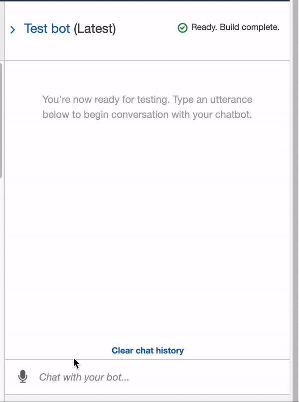

# Retirement Planner RoboAdvisor
For this assignment, I used AWS LEX and Python to create a RoboAdvisor that helps plan your retirement. The Advisor takes a series of parameters from the user to provide an investment recommendation for the retirement investment.

The Advisor uses an AWS Lambda Function in order to analyze the various inputs from the user to make a final recommendation for their investment. The lambda function also provides validation requirements for the parameters input by the user. If the validation requirements are not met, error messages are sent to the user.

## Parameters
* First name
* Age
* Investment amount
* Risk Level

## Parameter Requirements

For the Advisor parameters, the user needs to input their first name, their age, their investment amount, and their acceptable risk level. The bot validates these parameters before proceeding with the recommendation.
* The first requirement is that the user is younger than 65.
* The second requirement is that the user invests at least $5,000.

Lastly, using AWS I created a custom requirement: risk level. This creates 7 options for the user to select in terms of their acceptable risk level: none, very low, low, medium, high, and very high.

## Advisor Output

Based on the user's risk selection, the bot outputs various investment recommendations:

* None: "100% bonds (AGG), 0% equities (SPY)"
* Very low: "80% bonds (AGG), 20% equities (SPY)"
* Low: "60% bonds (AGG), 40% equities (SPY)"
* Medium: "40% bonds (AGG), 60% equities (SPY)"
* High: "20% bonds (AGG), 80% equities (SPY)"
* Very high: "0% bonds (AGG), 100% equities (SPY)"

---

## RoboAdvisor Demonstration
